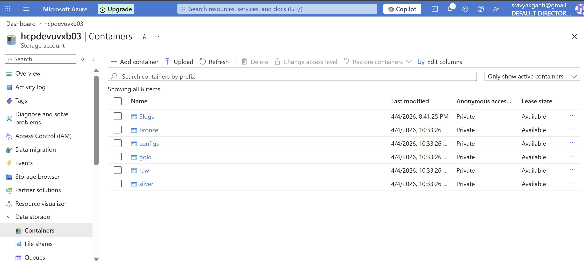
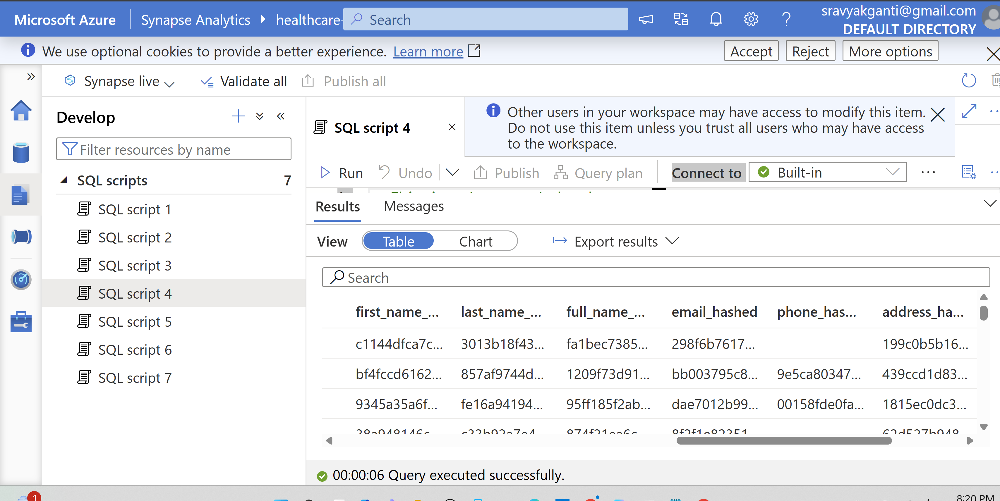
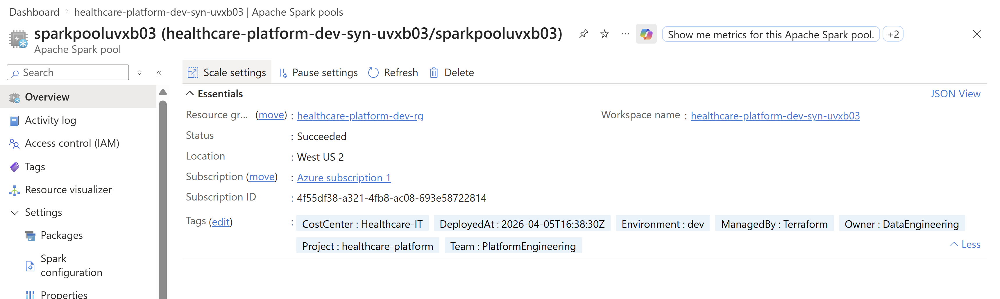

# Azure Healthcare Data Platform — Phase 1: Baseline Load

A production-grade, cloud-native healthcare data pipeline built on **Azure** using a **Medallion Architecture** (Bronze → Silver → Gold). Phase 1 provisions all infrastructure via Terraform and executes a full baseline ingestion of 254,537 healthcare records with HIPAA-compliant PII masking.

---

## Architecture Overview

```
data/raw/ (CSV)
    │
    ▼  [Stage 1: Ingest]
 BRONZE  — Raw Parquet, partitioned by ingestion_date, schema-validated
    │
    ▼  [Stage 2: Bronze → Silver]
 SILVER  — Cleaned, standardised, SHA-256 PII-masked, date-typed Parquet
    │
    ▼  [Stage 3: Silver → Gold]
  GOLD   — Analytics-ready aggregated tables (patient_360, encounter_summary,
            department_metrics, claims_analytics)
    │
    ▼  [Stage 4: Quality]
  REPORT — JSON data-quality report (completeness, referential integrity,
            duplicate detection, date validity)
```

All layers are persisted to **Azure Data Lake Storage Gen2** (ADLS Gen2) and queryable via **Azure Synapse Analytics**.

---

## Repository Structure

```
.
├── infrastructure/
│   └── terraform/               # Azure IaC — provision all cloud resources
│       ├── main.tf
│       ├── variables.tf
│       ├── outputs.tf
│       ├── providers.tf
│       └── terraform.tfvars.example
│
├── src/
│   ├── ingestion/               # Stage 1 — CSV → Bronze
│   │   ├── config.py            # Pydantic settings (env-var driven)
│   │   ├── validators.py        # Pandera schemas for all 4 datasets
│   │   └── ingest.py            # DataIngestionPipeline class
│   │
│   ├── processing/              # Stages 2-4 — Bronze → Silver → Gold
│   │   ├── bronze_to_silver.py  # SilverTransformer (cleaning + PII hashing)
│   │   ├── silver_to_gold.py    # GoldTransformer (aggregated analytics tables)
│   │   └── data_quality.py      # DataQualityChecker (JSON DQ report)
│   │
│   └── pipeline/
│       └── orchestrator.py      # HealthcarePipeline — runs all stages end-to-end
│
├── data/
│   └── samples/                 # First 100 rows of each source file (safe for Git)
│       ├── patients.csv
│       ├── encounters.csv
│       ├── lab_tests.csv
│       └── claims_and_billing.csv
│
├── tests/
│   ├── test_validators.py
│   └── test_transformations.py
│
├── docs/
│   └── prompts_baseline.md      # Prompt history for Phase 1
│
├── .env.example                 # Copy to .env and fill in Azure credentials
├── requirements.txt
└── README.md
```

---

## Phase 1 Deliverables

### 1. Infrastructure as Code (Terraform)

All Azure resources are defined in `infrastructure/terraform/` and provisioned with a single `terraform apply`. No manual portal clicks.

| Resource | Name | Purpose |
|---|---|---|
| Resource Group | `healthcare-platform-dev-rg` | Logical container for all resources |
| ADLS Gen2 | `hcpdevuvxb03` | Data lake — bronze / silver / gold containers |
| Azure Data Factory | `healthcare-platform-dev-adf-uvxb03` | Future orchestration |
| Azure Synapse | `healthcare-platform-dev-syn-uvxb03` | Analytics & SQL queries |
| Synapse Spark Pool | `sparkpooluvxb03` | Distributed processing |
| Key Vault | `hcp-dev-kv-uvxb03` | Secret management |
| Log Analytics | `healthcare-platform-dev-law-uvxb03` | Centralised logging |
| Application Insights | `healthcare-platform-dev-ai-uvxb03` | Pipeline telemetry |

### 2. Medallion Architecture

**Bronze** — Raw, immutable copy of source data. Validated with Pandera schemas. Partitioned by `ingestion_date`. 254,537 records across 4 datasets.

**Silver** — PII-scrubbed, typed, and enriched:
- `dob` cast to `date32` (YYYY-MM-DD, not a Unix epoch integer)
- All PII columns removed: `first_name`, `last_name`, `full_name`, `address`, `email`, `phone`, `registration_date`
- SHA-256 hashes retained for each PII field
- Derived columns: `age_group`, `is_readmitted`, `is_abnormal`, `payment_rate`

**Gold** — Four analytics-ready tables:

| Table | Rows | Description |
|---|---|---|
| `patient_360` | 60,000 | One row per patient with visit, lab, and financial KPIs |
| `encounter_summary` | 70,000 | Encounter-level financials; `is_anomaly` flag |
| `department_metrics` | 21 | Per-department aggregations |
| `claims_analytics` | 14 | Provider × claim-status breakdown with denial rates |

### 3. HIPAA PII Masking (SHA-256)

All personally identifiable fields are SHA-256 hashed before the Silver write. Raw values never leave the Bronze layer.

```python
# processing/bronze_to_silver.py
df["first_name_hashed"] = df["first_name"].apply(_sha256)
df["last_name_hashed"]  = df["last_name"].apply(_sha256)
df["email_hashed"]      = df["email"].apply(_sha256)
df["phone_hashed"]      = df["phone"].apply(_sha256)
df["address_hashed"]    = df["address"].apply(_sha256)

# Raw PII columns are then dropped — Silver is PII-free
df = df.drop(columns=["first_name", "last_name", "full_name",
                       "address", "email", "phone", "registration_date"])
```

The `_sha256` helper produces a deterministic 64-character hex digest, enabling record linkage across datasets without exposing raw PII.

---

## Quick Start

### Prerequisites
- Python 3.11+
- Terraform 1.5+
- Azure CLI (`az login` authenticated)

### 1. Clone and install dependencies

```bash
git clone <repo-url>
cd azure-healthcare-platform
pip install -r requirements.txt
```

### 2. Configure environment

```bash
cp .env.example .env
# Fill in AZURE_STORAGE_ACCOUNT_NAME and AZURE_STORAGE_ACCOUNT_KEY
```

### 3. Provision Azure infrastructure

```bash
cd infrastructure/terraform
terraform init
terraform plan      # Review 19 resources to be created
terraform apply -auto-approve
```

### 4. Run the pipeline

```bash
# Full end-to-end run
python src/pipeline/orchestrator.py --stage all

# Or stage by stage
python src/pipeline/orchestrator.py --stage ingest
python src/pipeline/orchestrator.py --stage bronze_silver
python src/pipeline/orchestrator.py --stage silver_gold
python src/pipeline/orchestrator.py --stage quality
```

---

## Data Samples

The `data/samples/` directory contains the first 100 rows of each source file. These are safe for version control and give reviewers a clear view of the data schema.

| File | Columns | Sample Rows |
|---|---|---|
| `patients.csv` | patient_id, dob, age, gender, ethnicity, insurance_type, ... | 100 |
| `encounters.csv` | encounter_id, patient_id, visit_date, visit_type, department, ... | 100 |
| `lab_tests.csv` | lab_id, encounter_id, test_name, test_date, test_result, status | 100 |
| `claims_and_billing.csv` | billing_id, patient_id, encounter_id, billed_amount, paid_amount, ... | 100 |

---

## Data Quality Results (Phase 1 Baseline)

- **Overall completeness:** 100.0% across all Silver datasets
- **Zero duplicate keys** in patients, encounters, and claims
- **Referential integrity:** 100% — all encounter and claim `patient_id` values match the patients table
- **Anomaly detection:** 4,403 patients (7.3%) flagged `is_anomaly = TRUE` (billed > 0 but paid = 0)

---

## System Verification & Azure Migration

Live evidence that the full pipeline ran end-to-end against a real Azure environment. All supporting artefacts are in [`docs/evidence/`](docs/evidence/).

---

### 1. Azure Data Lake Storage Gen2 — Medallion Containers



> **Fig 1.** Azure Portal view of the ADLS Gen2 storage account `hcpdevuvxb03` showing all five Medallion layer containers (`raw`, `bronze`, `silver`, `gold`, `configs`) provisioned by Terraform. Hierarchical Namespace (HNS) is enabled, confirming true Data Lake Gen2 semantics rather than standard blob storage.

---

### 2. SHA-256 PII Masking — Bronze vs Silver



> **Fig 2.** Side-by-side comparison of the same patient record at the Bronze layer (raw PII visible: name, address, email) and the Silver layer (all six PII columns replaced with deterministic SHA-256 hashes; `registration_date` dropped entirely). The `dob` field is cast from a raw string to an ISO `date32` type (`YYYY-MM-DD`). Raw PII never reaches Silver, Gold, or Synapse.  
> Full diff: [`docs/evidence/data_previews/`](docs/evidence/data_previews/)

---

### 3. Azure Synapse Analytics — Spark Pool Compute



> **Fig 3.** Azure Synapse Studio showing the `sparkpooluvxb03` Spark pool (Memory Optimized, 3–5 nodes, auto-pause 15 min) attached to workspace `healthcare-platform-dev-syn-uvxb03`. This pool is the distributed compute layer for large-scale transformations against the Silver and Gold ADLS containers.

---

### PII Masking Evidence Files

See [`docs/evidence/data_previews/`](docs/evidence/data_previews/) for auditable CSV samples:

| File | Description |
|------|-------------|
| `bronze_patients_sample.csv` | 5-row raw extract — real names, addresses, emails present |
| `silver_patients_sample.csv` | Same 5 patients post-masking — all PII replaced with SHA-256 hashes |
| `README.md` | Column-by-column diff table + runnable Python hash verification snippet |

### Data Quality Audit

Full results in [`docs/evidence/quality_report.md`](docs/evidence/quality_report.md). Key headline metrics:

| Metric | Result |
|--------|--------|
| Overall Silver completeness | **100%** (22 columns × 4 datasets) |
| Duplicate primary keys | **0** (patients, encounters, claims) |
| Referential integrity | **100%** across all 4 FK relationships |
| Anomalies detected (`billed > 0`, `paid = 0`) | **4,403 patients (7.3%)** |
| `overall_payment_rate = 0` false positives | **0** (COALESCE → NULL) |
| Denied claims identified | **5,998 (8.6%)** |
| Negative billing amounts | **0** |
| Raw PII columns in Silver / Gold | **0** |

### Infrastructure Map

Full 19-resource inventory in [`docs/evidence/terraform_resource_map.md`](docs/evidence/terraform_resource_map.md) — Terraform resource names, Azure names, security configuration, and all connectivity endpoints.

---

## Tech Stack

| Layer | Technology |
|---|---|
| Cloud | Microsoft Azure |
| IaC | Terraform (azurerm 3.x, azuread 2.x) |
| Storage | ADLS Gen2 (Hierarchical Namespace) |
| Analytics | Azure Synapse Analytics + Spark Pool |
| Orchestration | Azure Data Factory |
| Language | Python 3.11 |
| Data | Pandas 2.x, PyArrow 22.x |
| Validation | Pandera |
| Config | Pydantic-Settings |
| Logging | Loguru |
